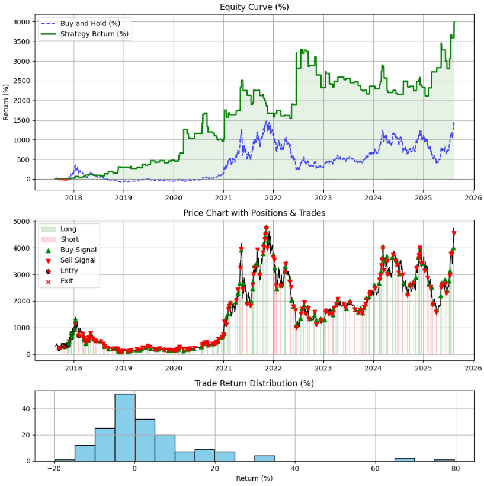
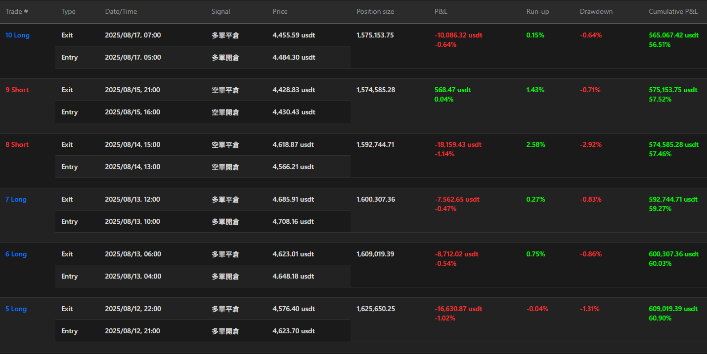

# Vedanta


Vedanta 是一個簡潔實用的加密貨幣交易策略回測與自動化交易服務。

## 專案概述

本專案 **Vedanta** 是一個專為加密貨幣交易設計的綜合性平台，提供從策略開發、回測、視覺化到線上自動交易的完整解決方案。它整合了幣安 API，並內建多種技術指標策略，讓使用者能夠高效地測試和部署交易策略。

### 主要功能：

*   **策略回測**：強大的回測引擎，支援多種技術指標策略，計算總回報、最大回撤、勝率等關鍵績效指標。
*   **線上自動交易**：將回測驗證過的策略無縫部署到線上環境，實現自動化交易。
*   **豐富的技術指標庫**：內建 ADX, Bollinger Bands, CCI, EMA, KD, MACD, Momentum, RSI, SMA, Smart Money, Williams 等多種技術指標策略。
*   **結果視覺化**：直觀的圖表展示回測結果，包括權益曲線、帶有持倉的價格圖和交易回報分佈。
*   **幣安 API 整合**：直接從幣安獲取實時 K 線數據，支援多種交易對和時間週期。

### 回測結果範例：






### 線上部署範例：


## 專案結構

### 模組架構圖(如何開發自己的策略)

只需參考以下圖片並參考Technicalindicatorstrategy資料夾底下檔案的作法 就會發現有一定格式
策略可以想像成這樣的流程
```bash
(幣種 交易週期 當前時間) -> 獲取多方數據 -> 聚合數據 -> 複雜買賣訊號計算 -> 輸出買賣訊號
```
只需用這個思路參考下面圖片和tvl_sma.py就知道怎麼設計自己的策略了


-   `backtest_usage.ipynb`: 示範如何使用回測功能並可視化結果的 Jupyter Notebook，詳細展示了如何載入數據、應用策略、執行回測並繪製結果。
-   `online_usage.ipynb`: 示範如何使用線上自動交易功能的 Jupyter Notebook，引導使用者配置和啟動自動交易。
-   `run.py`: 專案的主要執行入口點，負責整合選定的交易策略（例如 `testsma`）與線上自動交易模組 (`auto_trade_future`)，實現策略的自動化執行。
-   `Backtest/`: 包含核心的回測邏輯。
    -   `backtest.py`: 實現了強大的回測引擎，能夠根據歷史數據模擬交易，並計算總回報、最大回撤、勝率等關鍵績效指標。
-   `online/`: 包含線上自動交易的相關模組。
    -   `auto_trade.py`: 實現了現貨自動交易的核心邏輯，包括訂單管理、風險控制等。
    -   `auto_trade_future.py`: 專為期貨交易設計的自動交易邏輯，處理期貨特有的槓桿、保證金和強制平倉等機制。
-   `Plot/`: 包含繪圖功能。
    -   `plot.py`: 提供豐富的視覺化工具，將回測結果以圖形方式呈現，包括權益曲線、帶有持倉的價格圖和交易回報分佈，幫助使用者直觀分析策略表現。
-   `Technicalindicatorstrategy/`: 基於技術指標的交易策略集合。每個文件實現一個特定的策略，並提供一個生成交易信號的函數，這些策略可以直接用於回測和自動交易。
    -   `adx.py`: 平均趨向指標 (ADX) 策略，用於判斷趨勢強度。
    -   `boll.py`: 布林通道 (Bollinger Bands) 策略，用於衡量市場波動性。
    -   `cci.py`: 商品通道指標 (CCI) 策略，用於判斷超買超賣。
    -   `ema.py`: 指數移動平均線 (EMA) 交叉策略，常用於判斷趨勢轉向。
    -   `kd.py`: 隨機指標 (KD) 策略，用於判斷超買超賣和趨勢反轉。
    -   `macd.py`: 移動平均收斂發散 (MACD) 策略，用於判斷趨勢和動能。
    -   `momentum.py`: 動量策略，衡量價格變動的速度。
    -   `rsi.py`: 相對強弱指數 (RSI) 策略，用於判斷超買超賣。
    -   `sma.py`: 簡單移動平均線 (SMA) 交叉策略，用於判斷趨勢方向。
    -   `smartmoney.py`: 使用維加斯通道和船體移動平均線的聰明錢策略，旨在捕捉市場中的大資金流向。
    -   `testsma.py`: 簡單移動平均線 (SMA) 交叉策略的測試實例，展示了如何從幣安獲取 K 線數據並生成交易信號。
    -   `williams.py`: 威廉指標 (%R) 策略，用於判斷超買超賣。

## 如何安裝環境
### 普通Python安裝

1. **安裝python**
    請確保您的系統上已安裝 Python 3.10 以上版本。您可以從 [Python 官方網站](https://www.python.org/downloads/) 下載並安裝。


2. **安裝依賴套件:**
    ```bash
    pip install -r requirements.txt
    ```

### uv安裝(選擇性)
    ```bash
    uv sync 
    ```

## 如何使用

1.  **運行 Jupyter Notebooks:**
    *   打開 `backtest_usage.ipynb` 或 `online_usage.ipynb` 以了解如何導入和使用不同的策略、生成信號、運行回測以及繪製結果圖表。
2.  **配置線上交易 (可選):**
    複製 `.env-example` 為 `.env`，並填入您的 API 密鑰。
    *   如果需要進行線上自動交易，請根據 `online/` 目錄下的模組和 `run.py` 的範例，配置相關的 API 密鑰和交易參數。

## 依賴套件

-   pandas
-   numpy
-   matplotlib
-   requests
-   ccxt
-   python-dotenv

## 許可證

本專案根據 **GNU General Public License v3.0 (GPL-3.0)** 發布。

這意味著：
*   您可以自由地使用、修改和分發本軟體。
*   如果您分發本軟體的任何部分（無論是否修改），您必須以 GPL-3.0 許可證發布您的作品。
*   您必須提供本許可證的副本以及任何修改的原始碼。

有關完整的許可證條款，請參閱 [GNU General Public License v3.0](https://www.gnu.org/licenses/gpl-3.0.html)。
